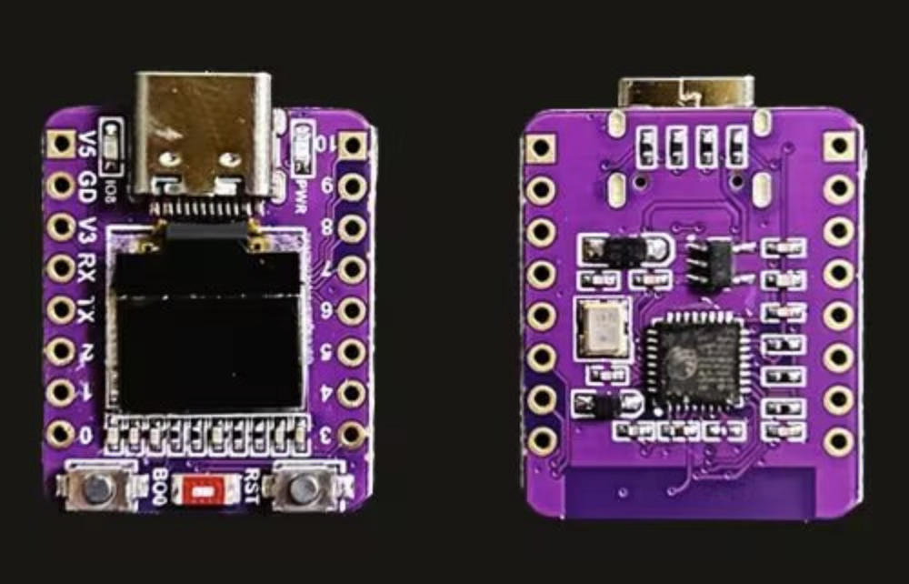
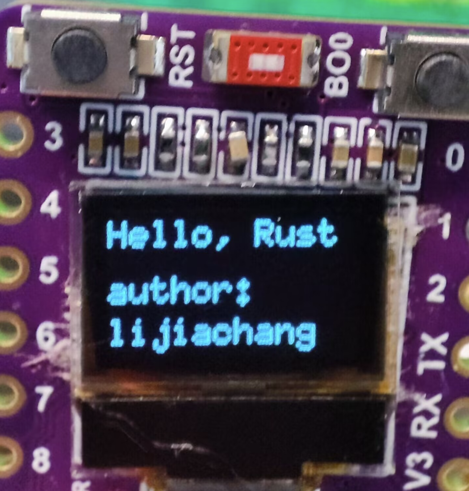
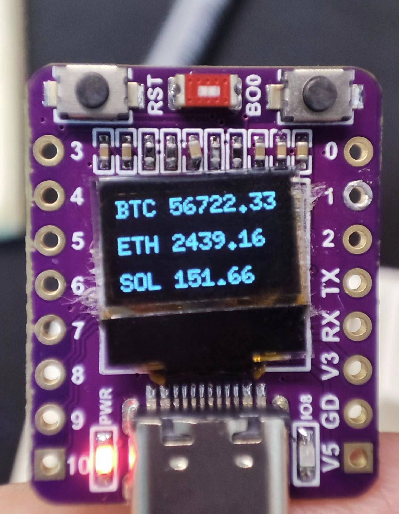
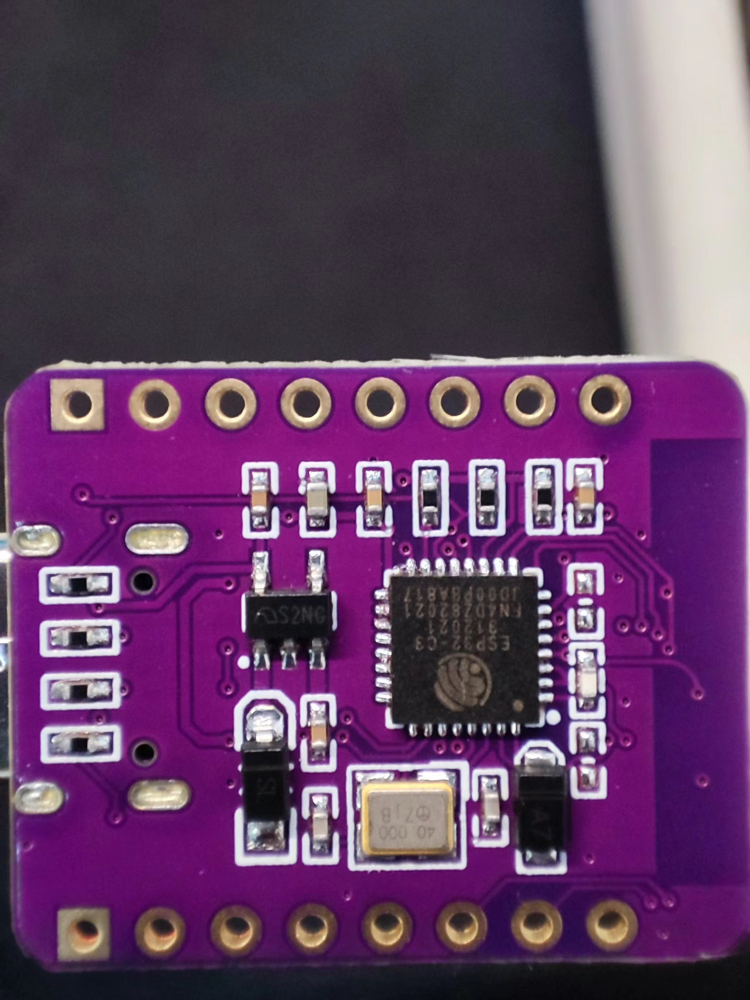

# Esp32-c3-oled-0.42-inch on Rust demo
* display on oled 0.42-inch 
* Wifi connect
* Http client
* Https client

注意，这是一个特殊的0.42寸屏幕，为此我耗费了很多时间编写驱动。此款屏幕与市面上常见的0.42寸的屏幕稍有差别，屏幕起点为12864的(30，14)
Note: This is a special 0.42-inch screen, for which I have spent a considerable amount of time writing the driver. 
This screen is slightly different from the common 0.42-inch screens available in the market. The starting point of this screen is (30, 14) on a 128x64 display.

# introduce 介绍





# generate project 生成项目
cargo generate esp-rs/esp-idf-template cargo

# build 构建
cargo build --release

# flash to esp32-c3 刷入固件到esp32-c3
espflash flash -p /dev/ttyACM0  target/riscv32imc-esp-espidf/release/rust-esp32c3-oled-0-42-inc
# Monitor printing of esp devices 监控esp设备的打印
espmonitor /dev/ttyACM0

# build  flash and monitor
cargo build --release && espflash flash -p /dev/ttyACM0  target/riscv32imc-esp-espidf/release/rust-esp32c3-oled-0-42-inch --monitor

```
   Finished `release` profile [optimized] target(s) in 11.19s
[2024-08-07T13:01:10Z INFO ] Serial port: '/dev/ttyACM0'
[2024-08-07T13:01:10Z INFO ] Connecting...
[2024-08-07T13:01:11Z INFO ] Using flash stub
Chip type:         esp32c3 (revision v0.3)
Crystal frequency: 40 MHz
Flash size:        4MB
Features:          WiFi, BLE
MAC address:       34:b4:72:4e:b2:24
App/part. size:    427,216/4,128,768 bytes, 10.35%
[2024-08-07T13:01:11Z INFO ] Segment at address '0x0' has not changed, skipping write
[2024-08-07T13:01:11Z INFO ] Segment at address '0x8000' has not changed, skipping write
[00:00:03] [========================================]     230/230     0x10000                                                                                                                                                                                                                                      [2024-08-07T13:01:16Z INFO ] Flashing has completed!
Commands:
    CTRL+R    Reset chip
    CTRL+C    Exit

ESP-ROM:esp32c3-api1-20210207
Build:Feb  7 2021
rst:0x15 (USB_UART_CHIP_RESET),boot:0xc (SPI_FAST_FLASH_BOOT)
Saved PC:0x40380566
0x40380566 - is_page_mapped_in_cache
    at ??:??
SPIWP:0xee
mode:DIO, clock div:2
load:0x3fcd5820,len:0x1714
load:0x403cc710,len:0x968
load:0x403ce710,len:0x2f9c
entry 0x403cc710
I (24) boot: ESP-IDF v5.1.2-342-gbcf1645e44 2nd stage bootloader
I (24) boot: compile time Dec 12 2023 10:50:58
I (25) boot: chip revision: v0.3
I (29) boot.esp32c3: SPI Speed      : 40MHz
I (34) boot.esp32c3: SPI Mode       : DIO
I (38) boot.esp32c3: SPI Flash Size : 4MB
I (43) boot: Enabling RNG early entropy source...
I (48) boot: Partition Table:
I (52) boot: ## Label            Usage          Type ST Offset   Length
I (59) boot:  0 nvs              WiFi data        01 02 00009000 00006000
I (67) boot:  1 phy_init         RF data          01 01 0000f000 00001000
I (74) boot:  2 factory          factory app      00 00 00010000 003f0000
I (82) boot: End of partition table
I (86) esp_image: segment 0: paddr=00010020 vaddr=3c050020 size=12914h ( 76052) map
I (111) esp_image: segment 1: paddr=0002293c vaddr=3fc8b800 size=0132ch (  4908) load
I (113) esp_image: segment 2: paddr=00023c70 vaddr=40380000 size=0b7b0h ( 47024) load
I (129) esp_image: segment 3: paddr=0002f428 vaddr=00000000 size=00bf0h (  3056) 
I (130) esp_image: segment 4: paddr=00030020 vaddr=42000020 size=48480h (296064) map
I (203) boot: Loaded app from partition at offset 0x10000
I (203) boot: Disabling RNG early entropy source...
I (215) cpu_start: Unicore app
I (224) cpu_start: Pro cpu start user code
I (224) cpu_start: cpu freq: 160000000 Hz
I (224) app_init: Application information:
I (227) app_init: Project name:     libespidf
I (232) app_init: App version:      b99c1b7-dirty
I (237) app_init: Compile time:     Aug  6 2024 22:38:51
I (243) app_init: ELF file SHA256:  000000000...
I (248) app_init: ESP-IDF:          v5.4-dev-1388-g5ca9f2a49a
I (255) efuse_init: Min chip rev:     v0.3
I (259) efuse_init: Max chip rev:     v1.99 
I (264) efuse_init: Chip rev:         v0.3
I (269) heap_init: Initializing. RAM available for dynamic allocation:
I (277) heap_init: At 3FC8DAE0 len 00032520 (201 KiB): RAM
I (283) heap_init: At 3FCC0000 len 0001C710 (113 KiB): Retention RAM
I (290) heap_init: At 3FCDC710 len 00002950 (10 KiB): Retention RAM
I (297) heap_init: At 50000200 len 00001DE8 (7 KiB): RTCRAM
I (304) spi_flash: detected chip: generic
I (307) spi_flash: flash io: dio
W (312) i2c: This driver is an old driver, please migrate your application code to adapt `driver/i2c_master.h`
W (322) timer_group: legacy driver is deprecated, please migrate to `driver/gptimer.h`
I (331) sleep: Configure to isolate all GPIO pins in sleep state
I (337) sleep: Enable automatic switching of GPIO sleep configuration
I (345) main_task: Started on CPU0
I (345) main_task: Calling app_main()
I (505) main_task: Returned from app_main()

```

# Wifi connect
## build
cargo b --bin wifi --release

## flash to esp32-c3  and monitor
espflash flash -p /dev/ttyACM0  target/riscv32imc-esp-espidf/release/wifi --monitor

# Http Client
## build
cargo b --bin http_client --release

## flash to esp32-c3  and monitor
espflash flash -p /dev/ttyACM0  target/riscv32imc-esp-espidf/release/http_client --monitor


# Https Client
## build
cargo b --bin https_client --release

## flash to esp32-c3  and monitor
espflash flash -p /dev/ttyACM0  target/riscv32imc-esp-espidf/release/https_client --monitor

# Crypto Price Display
## build
cargo b --bin crypto_price_display --release

## flash to esp32-c3  and monitor
espflash flash -p /dev/ttyACM0  target/riscv32imc-esp-espidf/release/crypto_price_display --monitor