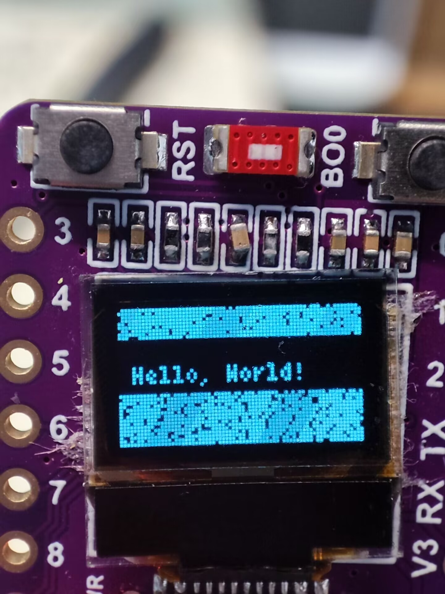

# Esp32 on Rust demo
* Make two LED lights flash
* Wifi connect
* Http client
* Https client

# introduce 介绍




# generate project 生成项目
cargo generate esp-rs/esp-idf-template cargo

# build 构建
cargo build --release

# flash to esp32-c3 刷入固件到esp32-c3
espflash flash -p /dev/ttyACM0  target/riscv32imc-esp-espidf/release/esp32-c3-led

```
[2024-07-14T13:31:30Z INFO ] Serial port: '/dev/ttyACM0'  
[2024-07-14T13:31:30Z INFO ] Connecting...  
[2024-07-14T13:31:30Z INFO ] Using flash stub  
Chip type:         esp32c3 (revision v0.4)  
Crystal frequency: 40 MHz  
Flash size:        4MB  
Features:          WiFi, BLE  
MAC address:       54:32:04:73:8b:44  
App/part. size:    410,944/4,128,768 bytes, 9.95%  
[2024-07-14T13:31:31Z INFO ] Segment at address '0x0' has not changed, skipping write  
[2024-07-14T13:31:31Z INFO ] Segment at address '0x8000' has not changed, skipping write  
[00:00:20] [========================================]     215/215     0x10000         
```


# Monitor printing of esp devices 监控esp设备的打印
espmonitor /dev/ttyACM0

```
ESPMonitor 0.10.0

Commands:
CTRL+R    Reset chip
CTRL+C    Exit

Opening /dev/ttyACM0 with speed 115200
Resetting device... done
esp32c3: SPI Mode       : DIO
I (44) boot.esp32c3: Sd.
I (40367) esp32_c3_led: loop start...
I (30) boot: ESP-IDF v5.1.2-342-gbcf1645e44 2nd stage bootloader
I (30) boot: compile time Dec 12 2023 10:50:58
I (31) boot: chip revision: v0.4
I (34) boot.esp32c3: SPI Speed      : 40MHz
I (39) boot.esp32c3: SPI Mode       : DIO
I (44) boot.esp32c3: SPI Flash Size : 4MB
I (49) boot: Enabling RNG early entropy source...
I (54) boot: Partition Table:
I (58) boot: ## Label            Usage          Type ST Offset   Length
I (65) boot:  0 nvs              WiFi data        01 02 00009000 00006000
I (72) boot:  1 phy_init         RF data          01 01 0000f000 00001000
I (80) boot:  2 factory          factory app      00 00 00010000 003f0000
I (87) boot: End of partition table
I (92) esp_image: segment 0: paddr=00010020 vaddr=3c050020 size=10c60h ( 68704) map
I (115) esp_image: segment 1: paddr=00020c88 vaddr=3fc8a000 size=010b0h (  4272) load
I (117) esp_image: segment 2: paddr=00021d40 vaddr=40380000 size=09ee0h ( 40672) load
I (131) esp_image: segment 3: paddr=0002bc28 vaddr=00000000 size=043f0h ( 17392)
I (135) esp_image: segment 4: paddr=00030020 vaddr=42000020 size=444e4h (279780) map
I (203) boot: Loaded app from partition at offset 0x10000
I (203) boot: Disabling RNG early entropy source...
I (214) cpu_start: Unicore app
I (214) cpu_start: Pro cpu up.
I (223) cpu_start: Pro cpu start user code
I (223) cpu_start: cpu freq: 160000000 Hz
I (223) cpu_start: Application information:
I (226) cpu_start: Project name:     libespidf
I (231) cpu_start: App version:      1
I (236) cpu_start: Compile time:     Jul 14 2024 21:23:56
I (242) cpu_start: ELF file SHA256:  0000000000000000...
I (248) cpu_start: ESP-IDF:          v5.1.4
I (253) cpu_start: Min chip rev:     v0.3
I (257) cpu_start: Max chip rev:     v1.99
I (262) cpu_start: Chip rev:         v0.4
I (267) heap_init: Initializing. RAM available for dynamic allocation:
I (274) heap_init: At 3FC8C1E0 len 00033E20 (207 KiB): DRAM
I (280) heap_init: At 3FCC0000 len 0001C710 (113 KiB): DRAM/RETENTION
I (287) heap_init: At 3FCDC710 len 00002950 (10 KiB): DRAM/RETENTION/STACK
I (295) heap_init: At 50000010 len 00001FD8 (7 KiB): RTCRAM
I (303) spi_flash: detected chip: generic
I (306) spi_flash: flash io: dio
W (310) timer_group: legacy driver is deprecated, please migrate to `driver/gptimer.h`
I (319) sleep: Configure to isolate all GPIO pins in sleep state
I (325) sleep: Enable automatic switching of GPIO sleep configuration
I (333) app_start: Starting scheduler on CPU0
I (337) main_task: Started on CPU0
I (337) main_task: Calling app_main()
I (337) esp32_c3_led: Hello, world!
I (347) gpio: GPIO[12]| InputEn: 0| OutputEn: 0| OpenDrain: 0| Pullup: 0| Pulldown: 0| Intr:0
I (357) gpio: GPIO[13]| InputEn: 0| OutputEn: 0| OpenDrain: 0| Pullup: 0| Pulldown: 0| Intr:0
I (367) esp32_c3_led: loop start...
I (2367) esp32_c3_led: loop end.
I (2367) esp32_c3_led: loop start...
I (4367) esp32_c3_led: loop end.
I (4367) esp32_c3_led: loop start...
I (6367) esp32_c3_led: loop end.
```

# Wifi connect
## build
cargo b --bin wifi --release

## flash to esp32-c3  and monitor
espflash flash -p /dev/ttyACM0  target/riscv32imc-esp-espidf/release/wifi --monitor

# Http Client
## build
cargo b --bin http_client --release

## flash to esp32-c3  and monitor
espflash flash -p /dev/ttyACM0  target/riscv32imc-esp-espidf/release/http_client --monitor


# Https Client
## build
cargo b --bin https_client --release

## flash to esp32-c3  and monitor
espflash flash -p /dev/ttyACM0  target/riscv32imc-esp-espidf/release/https_client --monitor